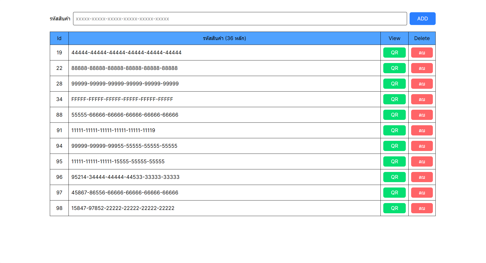
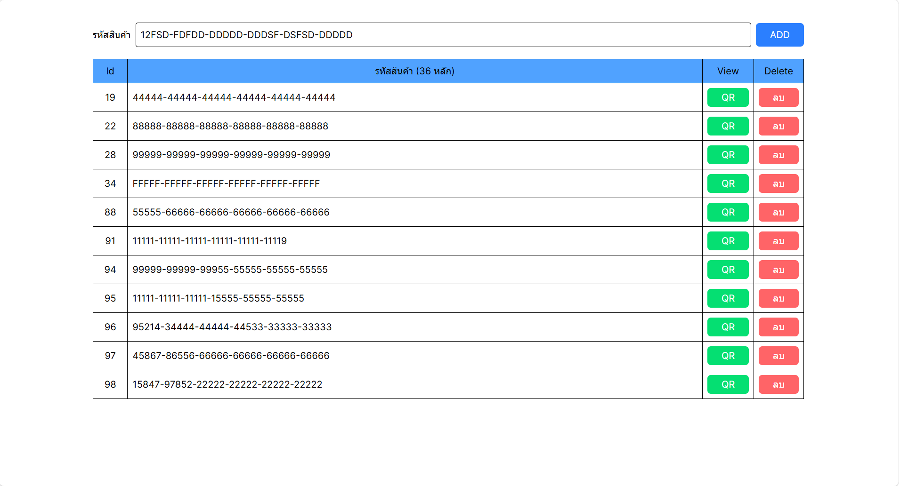
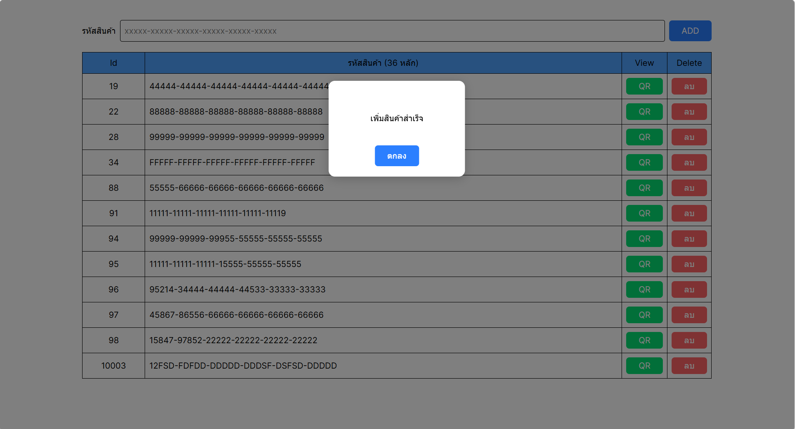
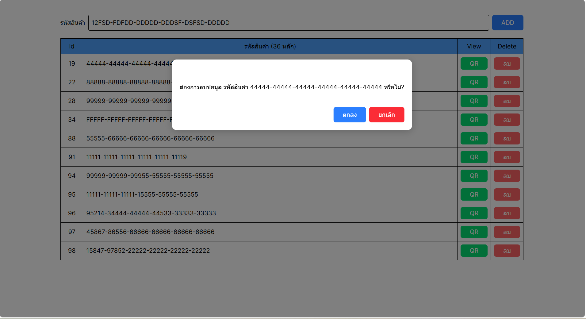
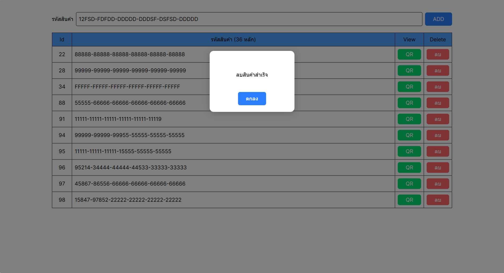
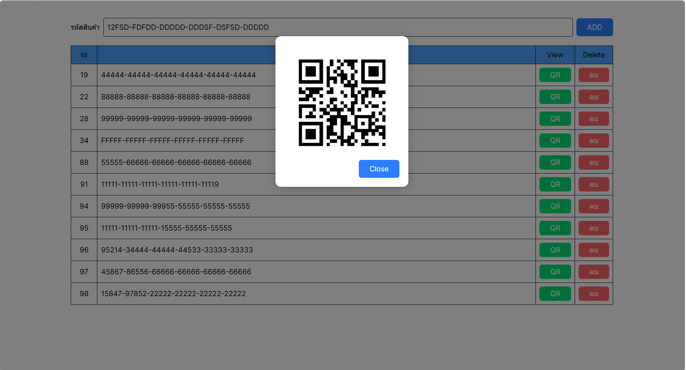

# GOLANG WITH ANGULAR

### Backend
- Language: Golang 1.25.5
- API Framework: Gin
- ORM: GORM

### Frontend
- Framework: Angular 21

## Subproject 
### Simple project management
#### Feature
1. **Show products**
<div align="center">
      
</div>

2. **Add product**
<div align="center">
      
      
</div>

3. **Delete product**
<div align="center">
      
      
</div>


4. **Show product QRcode**
<div align="center">
      
</div>

#### API endpoint

1. **Create products**
-  **Endpoint**: POST /api/products
-  **Description**: Create one or more tasks.
-  **Request Body** (JSON array):
 ```json
 [
	{
		"product_code": "123456789ABTOVEUTDOP"
	}
]
 ```

-  **Response** (Success):

  ```json
{
	"message": "Created successfuly.",
	"result": {
	"data": [
		{
			"id": 10002,
			"product_code": "123456789ABTOVEUTDOP"			
		}											
	  ]
	},
	"statusCode": 201,
	"success": true
}
```

2. **Get all products**
-  **Endpoint**: GET /api/products
-  **Description**: Get products.
-  **Response** (Success):
```json
{
	{
    "message": "Success",
    "result": {
        "data": [
            {
                "id": 10002,
                "product_code": "123456789ABTOVEUTDOP"
            }
        ]
    },
    "statusCode": 200,
    "success": true
}
}
```

3. **Delete products by ID**
-  **Endpoint**: DELETE /api/products/{id}
-  **Description**: Delete a product.
- **Example Request**: DELETE /api/products/10002
-  **Response** (Success):
```json
{
    "message": "Deleted successfuly.",
    "statusCode": 200,
    "success": true
}
```